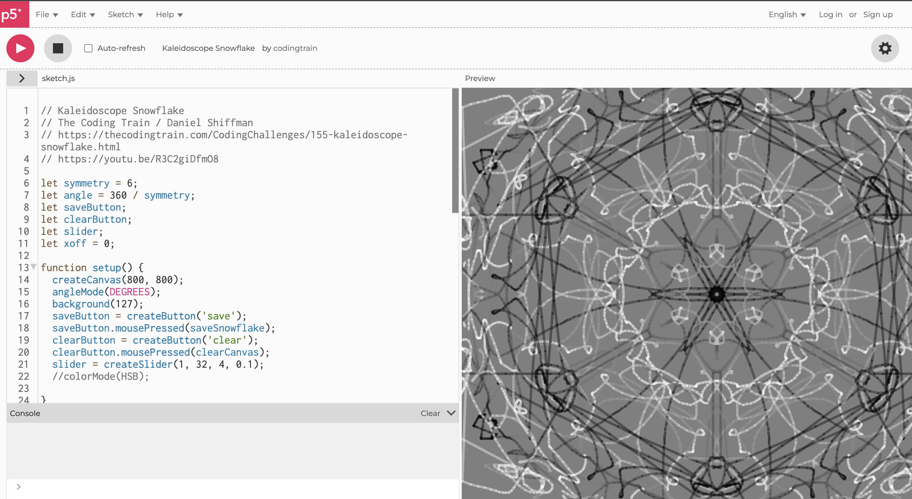

# shhu8232_9103_tut6

This is a repo that I will use to learn github.

## Quiz 8

1. I noticed the colours in the artwork for our final assignment were vibrant. When I saw Pashita Abad's 'Wheel of Fortune,' I thought of a graduation exhibition I had seen before, a project about kaleidoscopes capturing instant landscapes. I thought it would be fantastic to transform the circular pattern with the synchronized kaleidoscope hexagonal shifts, and it would be interesting to change the Wheel of Fortune with random colours and shapes. Below is a link to the inspiration image from the RCA2022 exhibition, Minglu Lu's "Instantaneous Landscapes."

2. I found an art project on the internet about coding kaleidoscopic forms that can be "replicated and painted" in six equal angles simultaneously as the mouse clicks. Maybe this "p5.js"-based coding can realize my idea.
### Github
[Link Text](https://github.com/CodingTrain/Code-of-Conduct)
### p5
[Link Text](https://editor.p5js.org/codingtrain/sketches/JbWCVPX5a)
