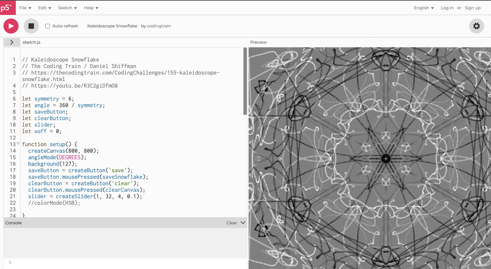

# shhu8232_9103_tut6

This is a repo that I will use to learn github.

## Final Assignment

This project utilizes the p5.js library to create a dynamic scene based on Edvard Munch's "The Scream". It includes pixelated imagery and animated figures, simulating a crowd moving across the painting.

### Features

- **Image Pixelation**: The iconic painting is broken into a grid of coloured squares, creating a pixelated effect.
- **Animated Figures**: Silhouettes of people are animated to walk across the canvas, adding life to the static image.
- **Interactive Lines**: The background includes lines that change angles and lengths over time, contributing to the dynamic feel of the scene.

### Setup
1. **Preload Image**: Place an image file titled "Edvard_Munch_The_Scream.jpeg" in the "Images" directory of your project.
2. **Initialize Variables**: The script uses global variables to control the animation and visual aspects of the scene, such as the slope of the animated figures' path and the size of the pixelation.
3. **Draw Loop**: The primary animation loop where the background image is displayed, particles are rendered, and figures are animated.

### Code Structure
- **preload()**: Preloads the image to avoid delays during rendering.
- **setup()**: Sets up the canvas and initializes the pixelation process.
- **draw()**: The main draw loop is called repeatedly to render the scene.
- **drawRandomLines()**: Draws interactive lines on the canvas.
- **lineSegment()**: Draws a segment of a line, used by `drawRandomLines()`.
- **drawPeople()**: Renders and animates figures across the canvas.
- **Particle class**: Represents a single pixelated square of the image.
- **pixelateImage()**: Converts the preloaded image into a grid of particles to create the pixelated effect.

### View
After setting up the project as described, run the p5.js sketch in a browser. You will see the pixelated background image with animated figures moving over it and dynamic lines interacting in the background.

### Screenshots
final group work

time-based part work

## Quiz 8

1. I noticed the colours in the artwork for our final assignment were vibrant. When I saw Pashita Abad's 'Wheel of Fortune,' I thought of a graduation exhibition I had seen before, a project about kaleidoscopes capturing instant landscapes. I thought it would be fantastic to transform the circular pattern with the synchronized kaleidoscope hexagonal shifts, and it would be interesting to change the Wheel of Fortune with random colours and shapes. Below is a link to the inspiration image from the RCA2022 exhibition, Minglu Lu's "Instantaneous Landscapes."

2. I found an art project on the internet about coding kaleidoscopic forms that can be "replicated and painted" in six equal angles simultaneously as the mouse clicks. Maybe this "p5.js"-based coding can realize my idea.
### Github
[Link Text](https://github.com/CodingTrain/Code-of-Conduct)
### p5
[Link Text](https://editor.p5js.org/codingtrain/sketches/JbWCVPX5a)

